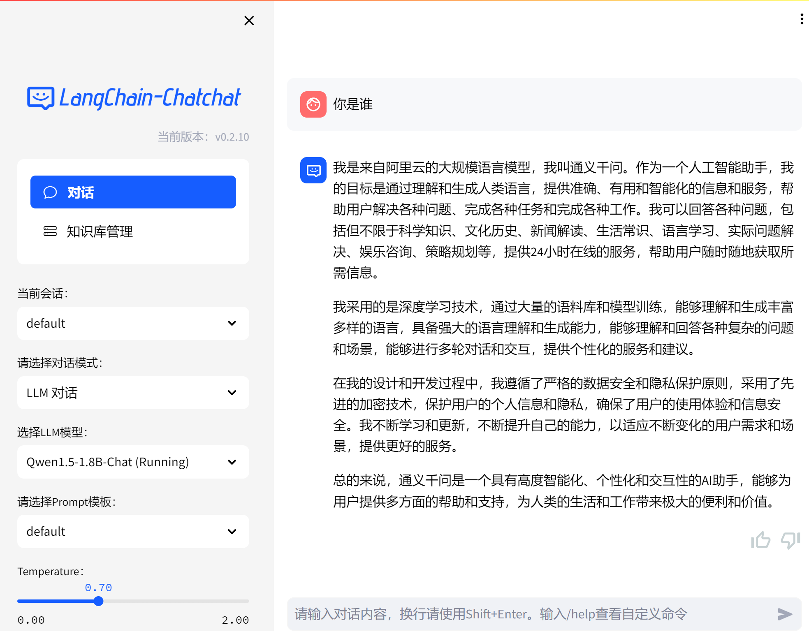

# Langchain-Chatchat-Colab
Colab for Langchain-Chatchat

在Colab上运行Langchain-Chatchat

## Open In Colab  (chatglm2-6b-int4 + m3e-base，可免费运行此版本)
  
使用LLM 模型 THUDM/chatglm2-6b-int4 与 默认的 Embedding 模型 moka-ai/m3e-base

## Preview

